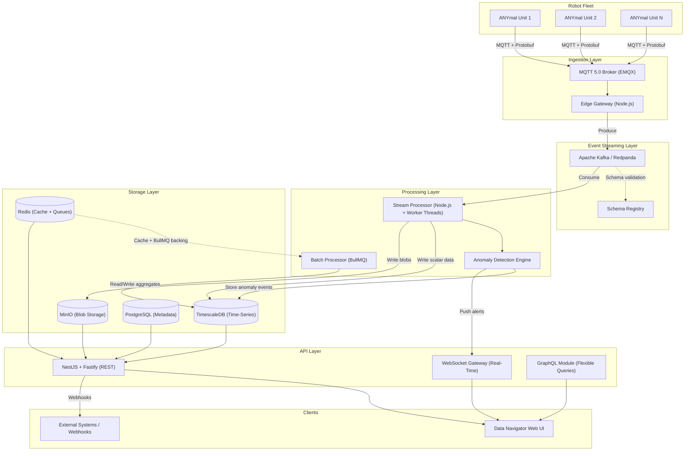
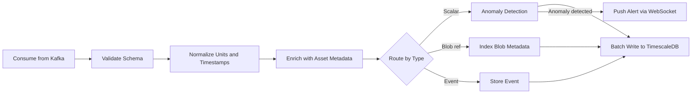
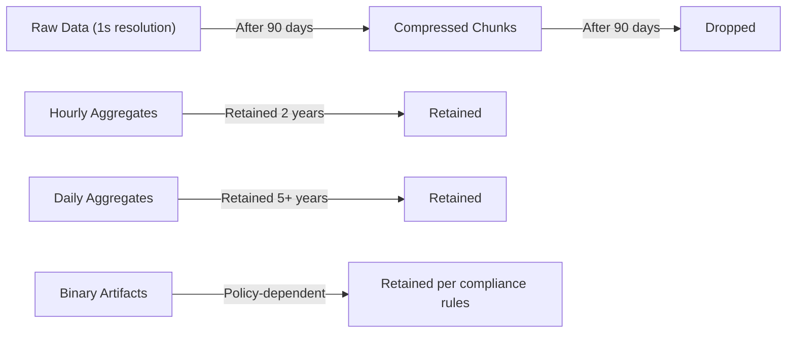
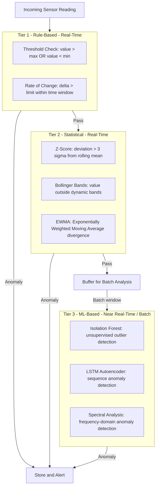
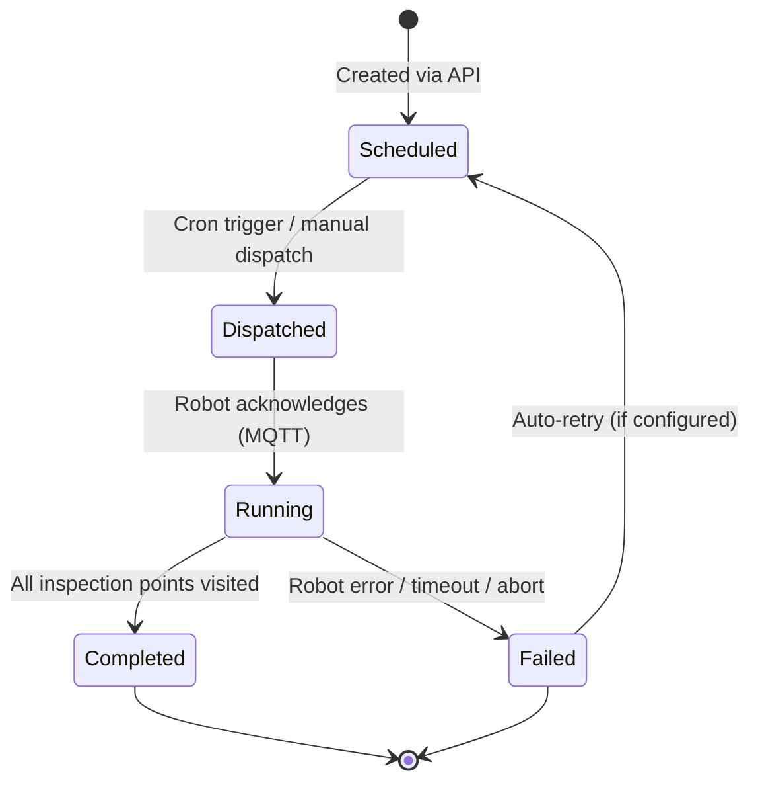
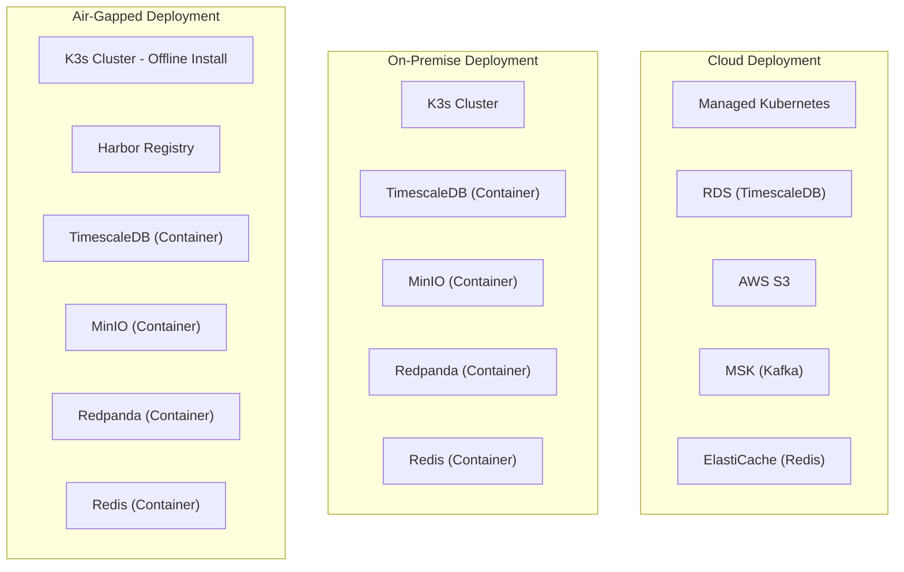
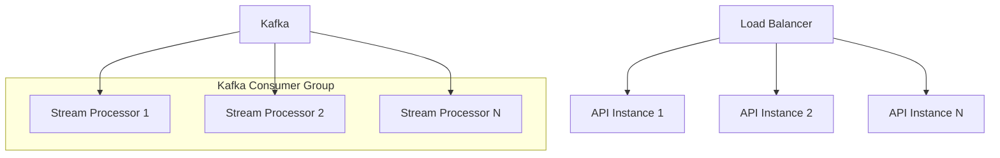
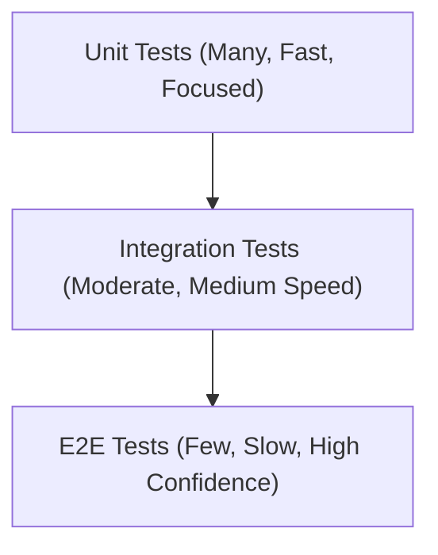

# Building a Backend from Scratch for Processing Time-Series Data from Robots

## Table of Contents

1. [Introduction and Problem Framing](#1-introduction-and-problem-framing)
2. [High-Level Architecture Overview](#2-high-level-architecture-overview)
3. [Data Ingestion Layer](#3-data-ingestion-layer)
4. [Message Broker / Event Streaming](#4-message-broker--event-streaming)
5. [Stream and Batch Processing](#5-stream-and-batch-processing)
6. [Storage Layer](#6-storage-layer)
7. [API Layer](#7-api-layer)
8. [Anomaly Detection and Analytics](#8-anomaly-detection-and-analytics)
9. [Mission Scheduling](#9-mission-scheduling)
10. [Infrastructure and Deployment](#10-infrastructure-and-deployment)
11. [Observability](#11-observability)
12. [Security](#12-security)
13. [Scalability and Performance](#13-scalability-and-performance)
14. [Testing Strategy](#14-testing-strategy)

---

## 1. Introduction and Problem Framing

### The Problem

Autonomous inspection robots like ANYmal operate in harsh industrial environments — power plants, oil refineries, mining facilities, chemical plants — where they collect high-frequency, multi-modal sensor data during every mission. This data is the lifeblood of predictive maintenance: it enables operators to detect equipment degradation before failures occur, reducing unplanned downtime and improving safety.

The challenge is building a backend system that can **reliably ingest, durably store, efficiently process, and meaningfully serve** this data to operators through a web-based platform (Data Navigator). The system must handle the unique characteristics of robot-generated time-series data while remaining deployable across vastly different infrastructure environments.

### Data Characteristics

ANYmal produces several distinct categories of data, each with different volume, velocity, and storage profiles:

| Data Category | Examples | Nature | Typical Frequency | Size per Sample |
|---|---|---|---|---|
| Scalar time-series | Temperature, pressure, vibration amplitude, gas concentration | Numeric values over time | 1 Hz – 1 kHz | 10–100 bytes |
| Binary blobs | Thermal images, RGB images, LIDAR point clouds, audio clips | Unstructured binary files | 0.1 – 10 Hz | 100 KB – 50 MB |
| Structured events | Anomaly detections, mission state transitions, system health | Discrete occurrences with metadata | Event-driven | 0.5 – 5 KB |
| Configuration / metadata | Robot registry, asset definitions, inspection points, user profiles | Slowly changing reference data | On change | Variable |

A single robot on a 2-hour inspection mission can generate **hundreds of thousands of scalar data points** and **thousands of binary artifacts**. A fleet of robots operating 24/7 across multiple sites amplifies this by orders of magnitude.

### Functional Goals

- **Ingest** data from a fleet of robots over potentially unreliable network connections
- **Store** time-series data, binary artifacts, and metadata with appropriate retention policies
- **Process** data in real-time (anomaly detection, alerting) and in batch (trend analysis, downsampling)
- **Serve** processed data through APIs that power dashboards, comparison views, and trendline visualizations
- **Schedule** and orchestrate inspection missions

### Non-Functional Goals

- **Deployment flexibility:** Must run on public cloud, on-premise infrastructure, and fully air-gapped networks — this is non-negotiable for industrial customers handling critical infrastructure
- **Horizontal scalability:** Must scale from a single-site pilot (one robot) to enterprise deployments (dozens of robots across multiple sites)
- **Reliability:** Data loss is unacceptable; inspection data often has regulatory or compliance implications
- **Low-latency real-time path:** Anomaly alerts must reach operators within seconds, not minutes
- **Maintainability:** A single backend language (Node.js/TypeScript) wherever feasible to minimize cognitive overhead and simplify hiring

---

## 2. High-Level Architecture Overview

The backend follows a **layered, event-driven architecture** where data flows through clearly separated stages. Each layer has a single responsibility and communicates with adjacent layers through well-defined interfaces. This separation enables independent scaling, deployment, and evolution of each component.



### Cross-Cutting Concerns

Three concerns span all layers and are treated as first-class architectural elements:

- **Observability:** Structured logging (Pino), metrics (Prometheus), distributed tracing (OpenTelemetry) — integrated into every service from day one
- **Security:** TLS/mTLS for all communication, JWT-based authentication, RBAC authorization, encryption at rest
- **Configuration:** Environment-based configuration with sensible defaults, managed through Kubernetes ConfigMaps/Secrets, with support for air-gapped environments where no external config services are available

---

## 3. Data Ingestion Layer

The ingestion layer is the bridge between the physical world (robots in the field) and the digital backend. It must handle the realities of industrial networking: intermittent connectivity, bandwidth constraints, and hostile RF environments.

### Protocol Choice: MQTT 5.0

**Selected:** MQTT 5.0 via the EMQX broker

MQTT is the natural choice for robot-to-backend communication. It was designed specifically for constrained devices and unreliable networks — exactly the conditions ANYmal operates in.

**Why MQTT 5.0 specifically:**

- **Quality of Service (QoS) levels:** QoS 1 (at-least-once delivery) guarantees that no inspection data point is silently lost, even if the network drops mid-transmission. QoS 2 (exactly-once) is available for critical events like anomaly alerts where deduplication matters. This is fundamental — in predictive maintenance, missing a single thermal reading that indicated overheating could mean missing a failure.
- **Persistent sessions:** When a robot temporarily loses connectivity (common in underground mines or RF-noisy industrial environments), the broker queues messages. The robot reconnects and resumes without data loss. MQTT 5.0's session expiry interval gives us fine-grained control over how long to retain queued messages.
- **Small protocol overhead:** MQTT's binary protocol has a minimal 2-byte fixed header. In bandwidth-constrained scenarios (e.g., robot communicating over industrial Wi-Fi), this matters. A single temperature reading transmitted via MQTT + Protobuf can be under 20 bytes total; the same data as a JSON HTTP POST would be 200+ bytes with headers.
- **Topic-based routing:** The hierarchical topic structure (`robots/{robot_id}/sensors/{sensor_type}/data`) maps naturally to the robot fleet model and enables selective subscription — the stream processor can subscribe only to vibration data if that is all it needs.
- **MQTT 5.0 enhancements over 3.1.1:** Shared subscriptions for load balancing across multiple consumers, message expiry to auto-discard stale data, user properties for metadata without payload modification, and enhanced error reporting.

**Why EMQX as the broker:** Open-source, supports clustering for high availability, handles millions of concurrent connections, has built-in rule engine for lightweight routing, and supports MQTT 5.0 fully. Alternative brokers like Mosquitto are simpler but lack clustering support, which is critical for production deployments.

### Alternatives Considered and Rejected

| Protocol | Strengths | Why Rejected |
|---|---|---|
| **gRPC** | Excellent performance, strong typing via Protobuf, bidirectional streaming | Requires persistent HTTP/2 connections — fragile under intermittent connectivity. No built-in QoS or store-and-forward semantics. Better suited for service-to-service communication within the backend than for robot-to-backend links. |
| **Raw WebSocket** | Low latency, full-duplex, widely supported | No built-in message QoS, ordering guarantees, or retry semantics. We would need to build all of these from scratch, essentially re-inventing MQTT poorly. |
| **ROS2 DDS Bridge** | Native to the robot's ROS2 ecosystem, zero transformation needed on the robot side | Couples the backend tightly to the ROS ecosystem. DDS discovery protocols are chatty and not designed for WAN communication. Adds significant operational complexity (DDS router configuration, domain bridging). The backend should be robot-framework-agnostic. |
| **HTTP REST (polling)** | Simple, universally understood | Polling introduces latency and wastes bandwidth. Not suitable for high-frequency streaming data. |
| **Apache Kafka (direct)** | Could eliminate the broker hop entirely | Kafka clients are heavyweight for embedded/edge devices. The Kafka protocol assumes reliable, low-latency networking. MQTT provides the impedance matching between constrained edge and robust backend. |

### Edge Gateway

Between the MQTT broker and the event streaming layer sits a lightweight **Edge Gateway** service written in Node.js. Its responsibilities:

- **Protocol translation:** Subscribes to MQTT topics, transforms messages, and produces them into Kafka. This decouples the robot communication protocol from the internal streaming backbone.
- **Data enrichment:** Attaches metadata (receive timestamp, robot ID normalization, site ID) before forwarding.
- **Binary data routing:** Scalar time-series data goes directly to Kafka. Binary blobs (images, point clouds) are uploaded to MinIO first, and a reference URI is sent to Kafka instead — this prevents large payloads from congesting the streaming pipeline.
- **Buffering and backpressure:** If Kafka is temporarily unavailable (e.g., during rolling upgrades), the gateway buffers messages in memory with configurable overflow-to-disk, preventing data loss.

### Data Serialization: Protocol Buffers

**Selected:** Protocol Buffers (protobuf) as the wire format between robots and the backend.

- **Compact:** 3–10x smaller than equivalent JSON, critical for bandwidth-constrained industrial networks
- **Schema-enforced:** The `.proto` schema serves as a contract between robot firmware and backend. Schema violations are caught at deserialization, not buried in runtime errors
- **Language-agnostic:** The robot firmware (typically C++) and the backend (Node.js) share the same schema definition, eliminating format mismatches
- **Schema evolution:** Fields can be added without breaking existing producers/consumers, essential for a fleet of robots that cannot all be updated simultaneously

**Alternatives rejected:** JSON (verbose, no schema enforcement, slower to parse), CBOR (compact but less tooling and ecosystem support than Protobuf), Avro (strong in the Kafka ecosystem but less common outside it; Protobuf is more universal).

---

## 4. Message Broker / Event Streaming

Once data enters the backend through the Edge Gateway, it needs a durable, high-throughput backbone for distributing it to multiple consumers — the stream processor, the batch processor, the anomaly detection engine, and potentially future services we haven't built yet.

### Choice: Apache Kafka (with Redpanda as On-Prem Alternative)

**Selected:** Apache Kafka as the primary event streaming platform, with Redpanda as a drop-in alternative for resource-constrained on-premise deployments.

**Why Kafka:**

- **Durable, append-only log:** Every message is persisted to disk and replicated across brokers. This is not just about reliability — it fundamentally changes what is possible. If we deploy a new anomaly detection algorithm next month, we can **replay the last 30 days of raw data** through it without asking robots to re-inspect. This replay capability is invaluable for iterating on analytics.
- **Consumer groups for parallel processing:** Multiple instances of the stream processor can form a consumer group, with Kafka automatically distributing partitions among them. Scaling processing is as simple as adding more consumer instances — Kafka handles the rebalancing.
- **Decoupling producers and consumers:** The Edge Gateway produces data into Kafka without knowing or caring what consumes it. Today that is the stream processor and the batch pipeline. Tomorrow it might also be an ML training pipeline or a data lake export. This extensibility is critical for a platform that will evolve over years.
- **Ordering guarantees within partitions:** By partitioning data by robot ID, we guarantee that all data from a single robot is processed in order — essential for time-series correctness.
- **Battle-tested at scale:** Kafka handles trillions of messages per day at companies like LinkedIn, Netflix, and Uber. For our scale (thousands to millions of messages per day), it is more than capable.
- **Rich ecosystem:** Schema Registry for schema evolution, Kafka Connect for integrations, extensive monitoring tooling.

**Why Redpanda as an alternative:** Redpanda is a Kafka-compatible streaming platform written in C++ that requires no JVM and no ZooKeeper. It uses significantly less memory and CPU than Kafka, making it ideal for on-premise deployments where hardware budgets are tight. Since it is wire-compatible with the Kafka protocol, our Node.js services using KafkaJS work unchanged — the switch is purely operational.

### Alternatives Considered and Rejected

| Broker | Strengths | Why Rejected |
|---|---|---|
| **RabbitMQ** | Mature, excellent for task queues and request-reply patterns, flexible routing with exchanges | Fundamentally a message queue, not an event log. Messages are deleted after acknowledgment — no replay capability. This is a dealbreaker for time-series workloads where reprocessing historical data is a core requirement. |
| **NATS JetStream** | Lightweight, extremely fast, simple operational model | Younger ecosystem compared to Kafka. Fewer operational tools, monitoring integrations, and community resources. Persistence and replay semantics, while functional, are less proven at scale. A viable choice for smaller deployments, but for a platform that will handle enterprise-scale data, Kafka's maturity is preferred. |
| **Redis Streams** | Already in the stack (we use Redis for caching), simple API | Not designed for durable, high-throughput event streaming. Limited consumer group semantics compared to Kafka. Memory-bound storage is expensive for large volumes of time-series data. Better used for lightweight, ephemeral event channels. |
| **AWS Kinesis / GCP Pub/Sub** | Managed, zero operational overhead | Vendor-specific, unavailable in on-premise and air-gapped deployments. ANYbotics' deployment flexibility requirement rules out cloud-only services as the primary backbone. |

### Topic Design

The topic structure reflects the natural hierarchy of the data:

```
robot-telemetry.{data_type}
```

Concrete topics:

| Topic | Content | Partitioning Key | Retention |
|---|---|---|---|
| `robot-telemetry.scalar` | Numeric sensor readings (temperature, pressure, vibration) | `robot_id` | 30 days |
| `robot-telemetry.blob-refs` | References (URIs) to binary objects stored in MinIO | `robot_id` | 30 days |
| `robot-telemetry.events` | Structured events (mission state changes, system health) | `robot_id` | 90 days |
| `robot-anomalies` | Detected anomalies (output of the anomaly engine) | `asset_id` | 365 days |
| `robot-commands` | Mission dispatch commands sent to robots (via MQTT bridge) | `robot_id` | 7 days |

**Partitioning strategy:** Using `robot_id` as the partition key ensures all data from a single robot lands in the same partition, maintaining strict temporal ordering per robot. The number of partitions per topic is set to at least the expected maximum number of consumer instances (e.g., 12 partitions allows up to 12 parallel consumers).

### Schema Registry

A **Schema Registry** (Confluent Schema Registry or Redpanda's built-in registry) stores the Protobuf schemas for each topic. Every message produced to Kafka includes a schema ID, enabling:

- **Backward/forward compatibility checks:** The registry rejects schema changes that would break existing consumers
- **Consumer-side deserialization without hardcoded schemas:** Consumers fetch the schema from the registry at runtime
- **Audit trail of schema evolution:** Every version is recorded, simplifying debugging when data format issues arise

---

## 5. Stream and Batch Processing

Data processing is split into two complementary pipelines: a **real-time stream pipeline** for low-latency use cases (anomaly alerting, live dashboards) and a **batch pipeline** for computationally heavier tasks (downsampling, historical trend computation, report generation).

### Real-Time Stream Processing

The stream processor is a cluster of **Node.js services** that consume from Kafka, apply transformations, and write results to storage and downstream systems.

**Why Node.js for stream processing:**

Node.js's event-loop architecture is a natural fit for stream processing workloads. Each message from Kafka triggers a sequence of asynchronous I/O operations — validate, enrich, write to TimescaleDB, potentially push an alert via WebSocket. These are I/O-bound operations where Node.js excels. The single-threaded event loop avoids the concurrency complexity of multi-threaded runtimes while delivering high throughput for I/O-heavy workloads.

**Kafka consumption** is handled via **KafkaJS**, the most mature pure-JavaScript Kafka client. It supports consumer groups, automatic offset management, and configurable batching.

**Processing stages for each message:**



**Key implementation details:**

- **Batch writes:** Instead of writing each data point individually, the processor buffers incoming points and flushes them to TimescaleDB in batches (configurable, e.g., every 1,000 points or every 500ms, whichever comes first). This dramatically improves write throughput — TimescaleDB handles bulk inserts orders of magnitude faster than individual row inserts.
- **Worker Threads for CPU-intensive tasks:** Certain operations are CPU-bound: FFT (Fast Fourier Transform) for vibration frequency analysis, statistical computations for anomaly detection on sliding windows, or image metadata extraction. These run in **Node.js Worker Threads** to avoid blocking the event loop. A thread pool (size = number of CPU cores) handles these computations, with a task queue for backpressure when the pool is saturated.
- **Graceful error handling:** Messages that fail processing are routed to a **dead-letter topic** in Kafka for later inspection and reprocessing, rather than blocking the pipeline. Transient errors (database timeouts) trigger retries with exponential backoff.
- **Offset commit strategy:** Offsets are committed after successful processing and storage write (at-least-once semantics). Combined with idempotent writes (using `ON CONFLICT` upserts keyed on `robot_id + timestamp + sensor_id`), this ensures no data loss and no duplicates.

### Batch Processing

The batch pipeline handles workloads that are too expensive to run on every incoming data point or that require looking at large historical windows.

**Orchestration:** **BullMQ** (Redis-backed job queue) manages batch jobs. BullMQ was chosen over alternatives like Agenda (MongoDB-dependent) or node-cron (no persistence, no retry) because it offers:

- Persistent job storage (jobs survive service restarts)
- Cron scheduling for recurring jobs
- Automatic retries with configurable backoff
- Job prioritization and rate limiting
- Concurrency control
- A built-in dashboard (Bull Board) for operational visibility

**Key batch jobs:**

| Job | Schedule | Description |
|---|---|---|
| **Downsampling** | Hourly | Aggregates raw 1-second data into 1-minute, 1-hour, and 1-day rollups. Uses TimescaleDB's `time_bucket` function with `AVG`, `MIN`, `MAX`, `STDDEV` aggregates. Essential for the Trendline View in Data Navigator. |
| **Continuous aggregate refresh** | Every 15 min | Refreshes TimescaleDB continuous aggregates, which are materialized views optimized for time-series rollup queries. |
| **Data retention cleanup** | Daily | Drops raw data chunks older than the configured retention period (e.g., 90 days). Aggregated summaries are retained longer (e.g., 2 years). Uses TimescaleDB's `drop_chunks` API. |
| **Anomaly report generation** | Daily / on-demand | Compiles anomaly summaries per asset/site for reporting and export. |
| **Blob lifecycle management** | Daily | Removes orphaned binary objects from MinIO that are no longer referenced by any time-series record. |

### When Node.js Is Not Enough

For computationally intensive ML model inference (e.g., neural network-based anomaly detection on vibration spectra or thermal image analysis), Node.js is not the right tool. These workloads are delegated to a **Python microservice** exposed via **gRPC**.

The boundary is clear and deliberate: Node.js handles all data ingestion, routing, storage I/O, and API serving. Python handles ML inference. Communication between them uses gRPC with Protobuf, maintaining the same schema rigor as the rest of the system. This avoids the trap of rewriting the entire backend in Python "because we need ML," while keeping the ML boundary clean and independently deployable.

---

## 6. Storage Layer

The storage layer is arguably the most critical architectural decision in a time-series backend. The choice must balance write throughput, query performance, compression efficiency, operational simplicity, and ecosystem compatibility.

### Time-Series Data: TimescaleDB

**Selected:** TimescaleDB — a PostgreSQL extension purpose-built for time-series data.

**This is the single most important technology choice in the architecture,** and the one with the deepest trade-off analysis.

**Why TimescaleDB:**

- **It is PostgreSQL.** TimescaleDB is not a separate database — it is an extension that adds time-series superpowers to PostgreSQL. This means the entire PostgreSQL ecosystem is available: mature drivers, ORMs, tooling, monitoring, backup solutions, replication, and — critically — the SQL query language that every engineer on the team already knows. There is no proprietary query language to learn.

- **Hypertables with automatic partitioning.** A TimescaleDB hypertable looks like a regular PostgreSQL table but is automatically partitioned into time-based chunks behind the scenes. Each chunk covers a configurable time interval (e.g., 1 day). This means:
  - **Write performance stays constant** as the dataset grows (new data always writes to the current chunk)
  - **Queries scoped to a time range** touch only relevant chunks, not the entire table
  - **Data retention is chunk-based** — dropping a month of data is an O(1) metadata operation, not a row-by-row delete

- **Native compression.** TimescaleDB's compression converts chunks from a row-oriented format to a columnar format, achieving **90–95% compression ratios** for typical time-series data. A year of data that would occupy 1 TB uncompressed fits in ~50–100 GB compressed. Compressed chunks remain queryable via standard SQL — decompression is transparent.

- **Continuous aggregates.** These are incrementally maintained materialized views that automatically update as new data arrives. For Data Navigator's Trendline View, we define continuous aggregates at 1-minute, 1-hour, and 1-day granularities. When a user views a 6-month trend, the query hits the pre-computed 1-day aggregate (thousands of rows) instead of scanning billions of raw data points.

- **PostGIS support.** ANYmal inspects physical assets with known locations. PostGIS enables spatial queries ("show me all temperature anomalies within 10 meters of pump P-101"), which is valuable for spatial visualization in Data Navigator.

- **JSONB for semi-structured metadata.** Robot sensor configurations can vary between models and firmware versions. JSONB columns allow storing variable metadata alongside strongly-typed time-series columns, without requiring a schema migration for every new sensor attribute.

### Alternatives Considered and Rejected

| Database | Strengths | Why Rejected |
|---|---|---|
| **InfluxDB** | Purpose-built for time-series, excellent write throughput, built-in downsampling | InfluxDB 3.x moved to a closed-source model with Apache Arrow-based storage. The query language shifted from InfluxQL to Flux (now deprecated) to SQL — the query story has been unstable. Clustering requires the Enterprise edition. The vendor direction risk is too high for a long-lived production platform. |
| **QuestDB** | Exceptional write performance (millions of rows/second), SQL support, columnar storage | Younger project with a smaller community and fewer production references at enterprise scale. Ecosystem tooling (backup, monitoring, replication) is less mature. A strong contender that may become the better choice in 2–3 years, but today TimescaleDB's maturity wins. |
| **ClickHouse** | Outstanding analytical query performance, columnar storage, excellent compression | Designed as an OLAP database, not an operational time-series store. Point queries and real-time inserts (the stream processor writing individual batches) are not its strength. Better positioned as a secondary analytics store if query demands outgrow TimescaleDB. |
| **Plain PostgreSQL (no TimescaleDB)** | Simpler stack, no extension dependency | Lacks automatic time-based partitioning, compression, continuous aggregates, and time-series-specific query optimizations. We would end up building a worse version of TimescaleDB manually. |

### Schema Design

```sql
-- Core hypertable for scalar time-series data
CREATE TABLE sensor_readings (
    time        TIMESTAMPTZ      NOT NULL,
    robot_id    UUID             NOT NULL,
    asset_id    UUID             NOT NULL,
    sensor_id   TEXT             NOT NULL,
    sensor_type TEXT             NOT NULL,
    value       DOUBLE PRECISION NOT NULL,
    unit        TEXT             NOT NULL,
    metadata    JSONB,
    quality     SMALLINT         DEFAULT 100
);

SELECT create_hypertable('sensor_readings', 'time',
    chunk_time_interval => INTERVAL '1 day',
    if_not_exists => TRUE
);

-- Compression policy: compress chunks older than 7 days
SELECT add_compression_policy('sensor_readings', INTERVAL '7 days');

-- Retention policy: drop raw data older than 90 days
SELECT add_retention_policy('sensor_readings', INTERVAL '90 days');

-- Continuous aggregate for hourly rollups
CREATE MATERIALIZED VIEW sensor_readings_hourly
WITH (timescaledb.continuous) AS
SELECT
    time_bucket('1 hour', time) AS bucket,
    robot_id,
    asset_id,
    sensor_id,
    sensor_type,
    AVG(value)    AS avg_value,
    MIN(value)    AS min_value,
    MAX(value)    AS max_value,
    STDDEV(value) AS stddev_value,
    COUNT(*)      AS sample_count
FROM sensor_readings
GROUP BY bucket, robot_id, asset_id, sensor_id, sensor_type;

-- Anomaly events table
CREATE TABLE anomaly_events (
    time          TIMESTAMPTZ NOT NULL,
    anomaly_id    UUID        NOT NULL DEFAULT gen_random_uuid(),
    robot_id      UUID        NOT NULL,
    asset_id      UUID        NOT NULL,
    sensor_id     TEXT        NOT NULL,
    severity      TEXT        NOT NULL CHECK (severity IN ('low', 'medium', 'high', 'critical')),
    anomaly_type  TEXT        NOT NULL,
    description   TEXT,
    value         DOUBLE PRECISION,
    threshold     DOUBLE PRECISION,
    blob_ref      TEXT,
    acknowledged  BOOLEAN     DEFAULT FALSE,
    metadata      JSONB
);

SELECT create_hypertable('anomaly_events', 'time');
```

### Binary/Blob Storage: MinIO

**Selected:** MinIO — an S3-compatible, high-performance object storage system.

**Why MinIO:**

- **S3 API compatibility:** The entire team, and practically the entire industry, knows the S3 API. SDKs, tools, and integrations are universally available.
- **Deployment flexibility:** MinIO runs identically as a self-hosted binary on-premise, as a container in Kubernetes, or can be swapped for actual AWS S3 in cloud deployments — the application code doesn't change. This directly satisfies ANYbotics' deployment requirement.
- **Air-gapped capable:** No cloud dependency whatsoever. Ships as a single binary or container image.
- **Erasure coding and bitrot protection:** Data integrity features that matter for long-lived inspection artifacts.

**Storage structure:**

```
bucket: inspection-data
├── thermal-images/{robot_id}/{mission_id}/{timestamp}.png
├── point-clouds/{robot_id}/{mission_id}/{timestamp}.pcd
├── audio-clips/{robot_id}/{mission_id}/{timestamp}.wav
└── reports/{site_id}/{date}/daily-report.pdf
```

Time-series records in TimescaleDB reference blob data via URIs (e.g., `s3://inspection-data/thermal-images/robot-01/mission-42/2025-01-15T14:30:00.png`), keeping the relational and blob storage cleanly separated.

### Metadata and Application State: PostgreSQL

The same PostgreSQL instance (or a separate instance in larger deployments) stores application-level data:

- **Robot registry:** Robot IDs, models, firmware versions, last-seen timestamps
- **Asset hierarchy:** Sites → Areas → Equipment → Inspection Points
- **User management:** Users, roles, teams, permissions
- **Mission definitions:** Schedule, inspection point lists, robot assignments
- **System configuration:** Per-tenant settings, retention policies, alert rules

**ORM:** Prisma is used for type-safe database access and migration management. Prisma's schema-first approach, auto-generated TypeScript types, and migration tooling provide a robust foundation for the application data layer. It integrates seamlessly with NestJS and provides excellent developer experience.

### Caching: Redis

Redis serves multiple roles in the architecture:

| Role | Usage |
|---|---|
| **Query cache** | Frequently accessed dashboards and aggregated views are cached with TTLs. When an operator views the same anomaly dashboard repeatedly, the response is served from Redis instead of re-querying TimescaleDB. |
| **Session store** | JWT refresh tokens and session metadata. |
| **Rate limiting** | Token bucket counters for API rate limiting. |
| **BullMQ backing store** | The batch processing job queue (BullMQ) uses Redis for job persistence, scheduling, and distributed locking. |
| **Real-time pub/sub** | Lightweight pub/sub for distributing WebSocket events across multiple API server instances (ensuring an anomaly alert reaches all connected clients regardless of which server they're connected to). |

**Why Redis over alternatives:** Redis is the de facto standard for in-memory data structures. It is fast, well-understood, and already required by BullMQ. Using it for caching and session storage consolidates infrastructure rather than introducing additional systems.

### Data Retention Strategy

Data retention is configurable per deployment and is a critical concern for industrial customers with varying regulatory requirements.



The key insight is that **raw data expires, but aggregated summaries persist**. An operator viewing a 3-year equipment health trend doesn't need 1-second resolution — the daily aggregate is sufficient and represents a compression ratio of 86,400:1.

---

## 7. API Layer

The API layer is the interface between the backend and the Data Navigator web application (and potentially other consumers like mobile apps, third-party integrations, or CLI tools). It must serve both traditional request-response queries and real-time streaming updates.

### Framework: NestJS with Fastify Adapter

**Selected:** NestJS — a progressive Node.js framework for building server-side applications — configured with the **Fastify HTTP adapter** instead of the default Express.

**Why NestJS:**

- **Modular architecture:** NestJS organizes code into modules, controllers, and services with a clear dependency injection system. For a large platform like Data Navigator — which has distinct domains (assets, robots, missions, users, analytics) — this modularity prevents the codebase from becoming a monolith of tangled imports. Each domain is a NestJS module with explicit boundaries.
- **First-class TypeScript:** NestJS is built in TypeScript from the ground up. Combined with Prisma's generated types and Protobuf-generated interfaces, the entire codebase benefits from end-to-end type safety — from Kafka message to API response.
- **Built-in support for multiple transport layers:** REST controllers, WebSocket gateways, GraphQL resolvers, and microservice transports (Kafka, MQTT, gRPC) are all first-class citizens in NestJS. We don't need separate frameworks for different communication patterns.
- **Decorator-based validation and documentation:** Request validation via `class-validator` decorators and automatic OpenAPI (Swagger) documentation generation from the same decorators. The API documentation stays in sync with the code by construction, not by discipline.
- **Guards, interceptors, and pipes:** Cross-cutting concerns like authentication (JWT guards), authorization (RBAC guards), logging (interceptors), and input transformation (pipes) are handled declaratively, keeping business logic clean.
- **Industry adoption and ecosystem:** NestJS is the most popular Node.js framework for enterprise applications, with a large community, extensive documentation, and a rich ecosystem of official and community modules.

**Why Fastify adapter over Express:**

The default NestJS HTTP adapter is Express. We swap it for Fastify for performance:

- **Throughput:** Fastify handles 2–3x more requests per second than Express in benchmarks, primarily due to its optimized routing algorithm (radix tree) and schema-based serialization.
- **Schema-based validation:** Fastify natively uses JSON Schema for request/response validation, which is compiled to optimized validation functions at startup — faster than runtime validation libraries.
- **Lower overhead:** Fastify's plugin architecture has less middleware overhead than Express's stack-based approach.

For a backend that will serve dashboard queries over potentially large time-series result sets, this performance advantage directly translates to lower response times and higher concurrent user capacity.

### Alternatives Considered and Rejected

| Framework | Strengths | Why Rejected |
|---|---|---|
| **Plain Fastify** | Top-tier performance, lightweight, excellent plugin system | Lacks the architectural opinions (DI, modules, decorators) needed for a large platform with multiple teams. Works well for microservices but requires more discipline to maintain consistency in a growing codebase. |
| **Express** | Ubiquitous, massive ecosystem, lowest learning curve | Slower than Fastify, minimalist by design (no built-in structure), requires assembling middleware for features NestJS includes out of the box. For a greenfield platform, Express's flexibility becomes a liability. |
| **Koa** | Elegant middleware model, lighter than Express | Smaller community and fewer enterprise-grade integrations. No advantage over Fastify for our use case. |
| **Hono** | Ultra-fast, works across runtimes (Node, Deno, Bun, Cloudflare Workers) | Very new, smaller ecosystem, less suited for large monolithic API services with complex DI requirements. |

### REST API Design

The REST API follows standard conventions with domain-specific considerations:

```
GET    /api/v1/robots                    # List robots
GET    /api/v1/robots/:id                # Get robot details
GET    /api/v1/robots/:id/telemetry      # Query time-series data

GET    /api/v1/assets                    # List assets (with hierarchy)
GET    /api/v1/assets/:id                # Get asset details
GET    /api/v1/assets/:id/readings       # Query sensor readings for an asset

GET    /api/v1/anomalies                 # List anomalies (filterable)
GET    /api/v1/anomalies/:id             # Get anomaly details
PATCH  /api/v1/anomalies/:id/acknowledge # Acknowledge an anomaly

GET    /api/v1/missions                  # List missions
POST   /api/v1/missions                  # Create/schedule a mission
GET    /api/v1/missions/:id              # Get mission details and status

GET    /api/v1/analytics/trends          # Trendline data for a sensor/asset
GET    /api/v1/analytics/comparison      # Compare readings across time periods
```

**Time-series query parameters:**

```
GET /api/v1/assets/abc-123/readings?
    sensor_type=temperature&
    from=2025-01-01T00:00:00Z&
    to=2025-01-31T23:59:59Z&
    resolution=1h&
    cursor=eyJ0aW1lIjoiMjAyNS0wMS0xNVQxMjowMDowMFoifQ==
```

- `resolution` maps to the appropriate continuous aggregate (raw, 1min, 1h, 1d) — the API automatically selects the best source based on the requested time range and resolution
- `cursor` enables cursor-based pagination using base64-encoded timestamps, which is the correct pagination strategy for time-series data (offset-based pagination breaks when new data arrives)

### WebSocket Gateway

Real-time communication uses WebSocket connections managed by NestJS's `@WebSocketGateway` decorator:

**Use cases:**
- **Live anomaly alerts:** When the anomaly engine detects an issue, the alert is pushed to all connected Data Navigator clients subscribed to that asset or site
- **Live sensor dashboards:** Operators monitoring an active inspection mission receive real-time sensor updates
- **Mission status updates:** Mission lifecycle events (started, waypoint reached, completed, failed) are pushed in real-time

**Scaling WebSockets across multiple API instances:** When the API layer is horizontally scaled (multiple NestJS instances behind a load balancer), a WebSocket event emitted on one instance must reach clients connected to other instances. Redis Pub/Sub is used as the broadcast transport — the `@nestjs/platform-socket.io` adapter with a Redis adapter ensures messages fan out to all instances.

### GraphQL (Optional Module)

A GraphQL endpoint is exposed via NestJS's `@nestjs/graphql` module for use cases where the REST API's fixed response shapes are too rigid:

- **Asset hierarchy queries:** "Give me all sites, their areas, equipment, and latest anomaly counts in a single request" — this is a deeply nested query that would require multiple REST calls or a custom endpoint. GraphQL handles it naturally.
- **Frontend flexibility:** The Data Navigator frontend team can iterate on dashboard layouts without requiring backend API changes for every new data combination.

GraphQL is positioned as a complement to REST, not a replacement. REST handles standard CRUD and time-series queries; GraphQL handles flexible, relationship-heavy queries.

### Authentication and Authorization

**Authentication: JWT + OAuth2/OIDC**

- Short-lived access tokens (15 minutes) and long-lived refresh tokens (7 days) with rotation
- OAuth2/OIDC integration for enterprise customers using existing identity providers (Azure AD, Okta, Keycloak)
- API keys for machine-to-machine integrations (webhooks, external systems)

**Authorization: Role-Based Access Control (RBAC)**

| Role | Permissions |
|---|---|
| **Admin** | Full access — user management, system configuration, all data |
| **Operator** | Mission management, robot control, all inspection data |
| **Maintenance Engineer** | Read anomalies, trends, and readings for assigned assets; acknowledge anomalies |
| **Viewer** | Read-only access to dashboards and reports |

RBAC is enforced at two levels:
1. **API Gateway (NestJS Guard):** Checks role permissions before the request reaches the controller
2. **Data level:** Queries are scoped by the user's assigned sites/assets, ensuring a maintenance engineer at Site A cannot access data from Site B

### Rate Limiting and Pagination

- **Rate limiting:** Token bucket algorithm implemented via Redis. Default: 100 requests/minute for standard endpoints, 1,000/minute for time-series reads (which are expected to be frequent). Configurable per role and per API key.
- **Pagination:** Cursor-based for time-series endpoints (timestamp cursors); offset-based for metadata lists (assets, robots, users) where the dataset is small and stable.

---

## 8. Anomaly Detection and Analytics

Anomaly detection transforms raw sensor data into actionable maintenance insights. This is what makes the difference between "a database of numbers" and "a system that prevents equipment failures."

### Tiered Detection Approach

The anomaly detection engine uses a tiered strategy, balancing speed, accuracy, and computational cost:



**Tier 1 — Rule-Based (Real-Time, Node.js):**

The simplest and fastest layer. Configurable per sensor type and per asset:
- **Absolute thresholds:** Temperature > 85°C on motor bearing M-101 → critical anomaly
- **Rate-of-change thresholds:** Temperature increase > 5°C in 10 minutes → warning
- **Missing data detection:** No reading from sensor S-42 for > 60 seconds → connectivity alert

These rules are stored in PostgreSQL and cached in Redis. Evaluation is trivial (comparison operations) and adds negligible latency to the stream processing pipeline.

**Tier 2 — Statistical (Real-Time, Node.js + Worker Threads):**

More sophisticated detection that adapts to the data's natural behavior:
- **Z-Score:** Flag readings more than 3 standard deviations from the rolling mean (window: configurable, e.g., last 1,000 readings). Effective for normally distributed sensor data.
- **Bollinger Bands:** Dynamic upper/lower bounds based on rolling mean ± k × rolling standard deviation. Well-suited for data with gradual trends (e.g., bearing wear that slowly increases vibration amplitude over weeks).
- **EWMA (Exponentially Weighted Moving Average):** More responsive to recent changes than simple moving averages, useful for detecting shifts in the data's baseline.

Statistical computations on sliding windows are CPU-intensive and run in **Worker Threads** to avoid blocking the event loop.

**Tier 3 — ML-Based (Near Real-Time / Batch, Python microservice):**

The most powerful but most computationally expensive tier, delegated to a Python microservice:
- **Isolation Forest:** Unsupervised outlier detection that works well with high-dimensional sensor data
- **LSTM Autoencoder:** Trained on "normal" operation data, it flags sequences that the model cannot reconstruct — effective for detecting novel failure modes
- **Spectral analysis:** FFT-based frequency analysis for vibration sensors, detecting bearing faults by their characteristic frequency signatures

The Python service is called via gRPC from the Node.js batch processor, not the real-time stream processor. Tier 3 operates on buffered windows of data (e.g., last 5 minutes) rather than individual points.

### Anomaly Lifecycle

Each detected anomaly follows a managed lifecycle:

```
Detected → Active → Acknowledged → Resolved
                  → Auto-Resolved (if readings return to normal for a configured duration)
```

Anomaly events are stored in the `anomaly_events` hypertable in TimescaleDB with full context: the triggering reading, the threshold or statistical bound that was violated, a severity level, and a reference to any associated binary data (e.g., the thermal image that shows the hot spot).

### Alert Dispatch

When an anomaly is detected:
1. **WebSocket push** to all connected Data Navigator clients subscribed to the relevant asset/site
2. **Optional webhook** to external systems (CMMS, SCADA, ticketing systems)
3. **Optional email notification** to configured recipients based on severity level and asset assignment

---

## 9. Mission Scheduling

The mission scheduler enables operators to plan, schedule, and dispatch inspection missions to the robot fleet.

### Architecture

**Job queue:** BullMQ handles the scheduling and execution orchestration:

- **Cron-based scheduling:** "Inspect Zone A every Tuesday and Thursday at 06:00" is expressed as a BullMQ repeatable job with a cron expression
- **One-time missions:** Triggered on-demand from the Data Navigator UI
- **Priority queue:** Urgent ad-hoc inspections can preempt scheduled ones

### Mission Lifecycle State Machine



### Robot Communication

Mission commands are published to Kafka on the `robot-commands` topic, which the Edge Gateway bridges to MQTT topics that the robot subscribes to:

```
robots/{robot_id}/commands/mission
```

The robot publishes status updates back via MQTT:

```
robots/{robot_id}/status/mission
```

This bidirectional MQTT communication enables real-time mission tracking in Data Navigator: operators can see which inspection point the robot is currently at, how much of the mission is complete, and receive immediate notification if the mission encounters an issue.

---

## 10. Infrastructure and Deployment

Deployment flexibility is a non-negotiable requirement. Industrial customers range from cloud-forward organizations to facilities with no internet connectivity whatsoever. The architecture must work across all three deployment models without code changes.

### Containerization: Docker

Every service is packaged as a Docker container using **multi-stage builds**:

```dockerfile
# Build stage
FROM node:20-alpine AS builder
WORKDIR /app
COPY package*.json ./
RUN npm ci --only=production
COPY . .
RUN npm run build

# Production stage
FROM node:20-alpine
WORKDIR /app
COPY --from=builder /app/dist ./dist
COPY --from=builder /app/node_modules ./node_modules
USER node
EXPOSE 3000
CMD ["node", "dist/main.js"]
```

Benefits: reproducible builds, minimal image sizes (Alpine-based), non-root execution, clear separation of build and runtime dependencies.

### Orchestration: Kubernetes

**Kubernetes (K8s)** is the orchestration layer across all deployment models:

| Deployment | K8s Distribution | Notes |
|---|---|---|
| **Cloud** | Managed K8s (EKS, GKE, AKS) | Least operational overhead; managed control plane, node autoscaling |
| **On-premise** | **K3s** (lightweight K8s by Rancher) | Single binary, low resource overhead, production-grade. Ideal for edge/on-prem where full K8s is overkill |
| **Air-gapped** | K3s with offline installation | Pre-packaged images, internal container registry (Harbor), no internet dependency at runtime |

**Helm charts** provide a single, parameterized deployment definition that works across all three models. Environment-specific differences (managed RDS vs. containerized PostgreSQL, S3 vs. MinIO) are handled via Helm values files.

**Key Kubernetes resources:**

- **Deployments** for stateless services (API, stream processor, edge gateway): Horizontal Pod Autoscaler (HPA) scales based on CPU/memory or custom metrics (Kafka consumer lag)
- **StatefulSets** for stateful services (TimescaleDB, Kafka/Redpanda, Redis): Persistent volumes, stable network identities, ordered scaling
- **CronJobs** for scheduled batch tasks that don't need BullMQ's full feature set
- **ConfigMaps and Secrets** for environment configuration and credentials

### Deployment Flexibility Matrix



The application code is identical across all three. Only the infrastructure layer changes, and that difference is captured entirely in Helm values files and Terraform/Ansible configurations.

### CI/CD Pipeline

```mermaid
flowchart LR
  Push[Git Push] --> Lint[Lint + Type Check]
  Lint --> UnitTest[Unit Tests]
  UnitTest --> IntTest["Integration Tests (Testcontainers)"]
  IntTest --> Build[Docker Build]
  Build --> Scan[Image Security Scan - Trivy]
  Scan --> Push2[Push to Registry]
  Push2 --> DeployStaging[Deploy to Staging - Helm]
  DeployStaging --> E2E[E2E Tests]
  E2E --> DeployProd[Deploy to Production - Helm]
```



**Tooling:** GitHub Actions or GitLab CI (both work; GitLab CI is more common in European industrial companies). Terraform manages cloud infrastructure; Ansible handles on-premise provisioning.

---

## 11. Observability

In a distributed system processing time-critical industrial data, observability is not a nice-to-have — it is essential for operational confidence. The three pillars of observability (logs, metrics, traces) are integrated from day one, not bolted on after the first outage.

### Structured Logging

**Logger:** Pino — the fastest Node.js JSON logger, with ~5x throughput over Winston in benchmarks.

Every log entry is structured JSON with consistent fields:

```json
{
  "level": "info",
  "time": "2025-06-15T14:30:00.123Z",
  "service": "stream-processor",
  "traceId": "abc123def456",
  "robotId": "anymal-07",
  "msg": "Batch write completed",
  "recordCount": 1247,
  "durationMs": 42
}
```

**Collection pipeline:** Pino → stdout → Fluent Bit (sidecar) → Grafana Loki (or Elasticsearch for customers who prefer it)

Why Loki over Elasticsearch: Loki indexes only labels (service name, log level), not full text. This makes it dramatically cheaper to operate for high-volume log storage, which matters for on-premise deployments with limited hardware. Full-text search is available but queries scan log content at read time rather than maintaining a full inverted index.

### Metrics

**Stack:** Prometheus (collection) + Grafana (visualization and alerting)

**Application metrics exposed via `/metrics` endpoint on every service:**

| Metric | Type | Description |
|---|---|---|
| `ingestion_messages_total` | Counter | Total messages received from MQTT |
| `kafka_consumer_lag` | Gauge | Consumer lag per topic-partition (critical for detecting processing bottlenecks) |
| `tsdb_write_duration_seconds` | Histogram | TimescaleDB write latency distribution |
| `tsdb_write_batch_size` | Histogram | Batch sizes for TimescaleDB inserts |
| `api_request_duration_seconds` | Histogram | API response time by endpoint and status code |
| `anomaly_detections_total` | Counter | Anomalies detected, labeled by severity and type |
| `ws_connected_clients` | Gauge | Active WebSocket connections |
| `bullmq_job_duration_seconds` | Histogram | Batch job execution time by job type |
| `bullmq_jobs_waiting` | Gauge | Pending jobs in the batch queue |

**Grafana dashboards** are pre-built and shipped with the Helm chart:
- **System Overview:** Request rate, error rate, latency P50/P95/P99 across all services
- **Ingestion Pipeline:** MQTT message rate, Kafka throughput, consumer lag, processing latency
- **Storage Health:** TimescaleDB write rate, compression ratio, disk usage, active connections
- **Anomaly Detection:** Detection rate, severity distribution, alert delivery latency

### Distributed Tracing

**Stack:** OpenTelemetry SDK (instrumentation) → Grafana Tempo or Jaeger (backend)

Every request — from MQTT message arrival through Kafka processing to TimescaleDB write — carries a trace ID. This enables:

- **End-to-end latency profiling:** "How long from robot sensor reading to dashboard display?"
- **Bottleneck identification:** "Is the latency in Kafka consumption, anomaly detection, or the database write?"
- **Cross-service debugging:** Following a single data point's journey through the entire system

The OpenTelemetry SDK provides automatic instrumentation for HTTP, gRPC, PostgreSQL, Redis, and Kafka — minimal code changes required.

### Health Checks

Every service exposes:
- **`/health/live`:** Liveness probe — "is the process running?" Used by Kubernetes to restart crashed containers.
- **`/health/ready`:** Readiness probe — "is the service ready to serve traffic?" Checks database connectivity, Kafka connectivity, and Redis availability. Used by Kubernetes to route traffic only to healthy instances.

---

## 12. Security

Industrial inspection data can be sensitive (facility layouts, equipment condition, operational patterns). The security posture must satisfy enterprise customers and regulatory requirements.

### Transport Security

- **External (robot-to-backend):** TLS 1.3 for all MQTT connections. Client certificates for robot authentication — each ANYmal has a unique X.509 certificate provisioned during manufacturing.
- **Internal (service-to-service):** mTLS enforced via a service mesh (Linkerd, preferred over Istio for its simplicity and lower resource overhead) or Kubernetes network policies with cert-manager for automated certificate rotation.
- **API (client-to-backend):** TLS 1.3, HSTS headers, certificate pinning recommended for the Data Navigator web app.

### Authentication

**JWT with refresh token rotation:**

- Access tokens: Short-lived (15 minutes), signed with RS256 (asymmetric), containing user ID, roles, and assigned sites
- Refresh tokens: Longer-lived (7 days), stored server-side in Redis with one-time-use enforcement (rotation on every refresh). Compromised refresh tokens are detected by replay attempts.
- Token revocation: Immediate revocation via a Redis-backed blacklist checked on every request

**Enterprise SSO:** OAuth2/OIDC integration via Passport.js strategies (Azure AD, Okta, Keycloak). Enterprise customers can use their existing identity provider — no need to manage separate credentials.

**Machine-to-machine:** API keys with scoped permissions for webhook integrations and external system access.

### Authorization (RBAC)

RBAC is enforced at two levels:

1. **Route-level guards:** NestJS guards check the user's role against the required permission for each endpoint before the request reaches the controller. Declarative via custom decorators:

```typescript
@Get('anomalies')
@RequireRoles(Role.OPERATOR, Role.MAINTENANCE_ENGINEER, Role.ADMIN)
async listAnomalies(@Query() query: ListAnomaliesDto) { ... }
```

2. **Data-level scoping:** Database queries are automatically filtered by the user's assigned sites and assets. A maintenance engineer assigned to "Site Alpha" never sees data from "Site Beta," regardless of what API endpoint they call. This is implemented as a NestJS interceptor that injects scope filters into every database query.

### Data Protection

- **Encryption at rest:** TimescaleDB with Transparent Data Encryption (TDE); MinIO with Server-Side Encryption (SSE-S3); Redis with TLS and optional at-rest encryption
- **Encryption in transit:** TLS/mTLS everywhere, as described above
- **Input validation:** Every data boundary has validation:
  - Robot → Backend: Protobuf schema enforcement
  - Client → API: `class-validator` decorators on DTOs with Zod schemas for complex validations
  - Kafka → Consumer: Schema Registry validation

### Air-Gapped Security Considerations

Air-gapped deployments have unique security properties:

- **No outbound connections:** The system never reaches out to the internet. All dependencies (container images, npm packages, OS packages) are pre-bundled.
- **Internal PKI:** An internal Certificate Authority (managed by cert-manager) issues and rotates all certificates. No dependency on Let's Encrypt or external CAs.
- **Update delivery:** Software updates are delivered as signed, offline bundles (container image tarballs + Helm chart bundles) verified against a public key embedded during initial deployment.
- **Dependency auditing:** `npm audit` and Trivy container scanning run during CI/CD, before the bundle is created. Vulnerability reports are included with each release.

### OWASP Top-10 Mitigations

| Threat | Mitigation |
|---|---|
| Injection | Parameterized queries via Prisma ORM; input validation on all endpoints |
| Broken Authentication | JWT with short expiry, refresh rotation, bcrypt for stored credentials |
| Sensitive Data Exposure | TLS everywhere, encryption at rest, no secrets in logs |
| XML External Entities | No XML processing; JSON/Protobuf only |
| Broken Access Control | RBAC guards + data-level scoping |
| Security Misconfiguration | Hardened Docker images (non-root, minimal base), automated security scanning |
| XSS | Not directly applicable (API-only backend), but Content-Security-Policy headers are set |
| Insecure Deserialization | Protobuf schema validation; class-transformer with `whitelist: true` |
| Using Components with Known Vulnerabilities | Automated dependency auditing in CI/CD (npm audit, Snyk, Trivy) |
| Insufficient Logging and Monitoring | Structured logging, security event alerting, audit trail for sensitive operations |

---

## 13. Scalability and Performance

The system must scale from a pilot deployment (1 robot, 1 site, a handful of users) to enterprise scale (dozens of robots, multiple sites, hundreds of users) without architectural changes — only operational scaling.

### Horizontal Scaling Strategy



**Stateless services (API, Stream Processor, Edge Gateway):**
- Horizontally scaled via Kubernetes HPA
- Kafka consumer groups automatically distribute partitions across stream processor instances
- API instances are interchangeable behind a load balancer; sticky sessions are not required (JWT is self-contained)

**Stateful services (TimescaleDB, Kafka, Redis):**
- Scaled vertically first (larger instances), then via replication:
  - TimescaleDB: Read replicas for query load distribution; write-primary architecture
  - Kafka/Redpanda: Add brokers, increase partition count
  - Redis: Redis Sentinel for HA, Redis Cluster for sharding if needed

### Write Optimization

Time-series write throughput is the primary performance bottleneck. Optimizations:

- **Batch inserts:** The stream processor buffers data points and flushes in batches (e.g., 1,000–5,000 rows per `INSERT`). TimescaleDB is optimized for bulk inserts — a batch of 5,000 rows is nearly as fast as a single row insert.
- **COPY protocol:** For very high throughput scenarios, PostgreSQL's `COPY` command (binary mode) is used instead of `INSERT`, providing 2–5x additional throughput.
- **Prepared statements:** Prisma and the raw query layer use prepared statements, eliminating query parsing overhead on repeated writes.
- **Connection pooling via PgBouncer:** A PgBouncer instance sits between the application and TimescaleDB, pooling connections in transaction mode. This allows hundreds of concurrent application connections to be served by a smaller number of database connections, avoiding PostgreSQL's process-per-connection overhead.

### Read Optimization

Dashboard queries can span large time ranges and must respond within interactive latency budgets (~200ms for P95):

- **Continuous aggregates:** Pre-computed rollups at 1-minute, 1-hour, and 1-day granularities. The API layer automatically selects the appropriate aggregate based on the requested time range and resolution.
- **Redis caching:** Dashboard queries that are repeated (e.g., multiple operators viewing the same anomaly dashboard) are cached with short TTLs (30–60 seconds). Cache invalidation is event-driven: when new anomaly data arrives, the relevant cache keys are evicted.
- **Cursor-based pagination:** Time-series queries use timestamp-based cursors, ensuring consistent pagination even as new data arrives.
- **Query result streaming:** For large exports, the API streams results using Node.js streams and PostgreSQL cursors, avoiding loading entire result sets into memory.

### Backpressure Management

Backpressure is a critical concern in a streaming pipeline — if the stream processor falls behind, the system must degrade gracefully rather than crash.

- **Kafka provides natural backpressure:** If consumers are slow, messages accumulate in Kafka (durable storage). The consumer lag metric in Prometheus alerts operators and triggers HPA scaling.
- **BullMQ rate limiting:** Batch jobs that generate heavy database load are rate-limited to prevent overwhelming TimescaleDB during peak ingestion.
- **Circuit breakers:** If TimescaleDB becomes unresponsive, the stream processor's database write circuit breaker opens, causing messages to remain in Kafka (buffered) rather than timing out and being retried in a thundering herd.

### Capacity Planning Guidelines

| Scale | Robots | Messages/sec | Storage/month | Recommended Resources |
|---|---|---|---|---|
| **Pilot** | 1–2 | ~100 | ~5 GB | 2-node K3s, single TimescaleDB instance |
| **Production** | 5–10 | ~1,000 | ~50 GB | 3-node K8s cluster, TimescaleDB with read replica |
| **Enterprise** | 20–50 | ~5,000 | ~250 GB | 5+ node K8s cluster, TimescaleDB HA, 3-node Kafka/Redpanda |

---

## 14. Testing Strategy

A robust testing strategy is essential for a system where failures can result in missed equipment degradation and, by extension, safety incidents or unplanned downtime.

### Testing Pyramid



### Unit Tests

**Framework:** Jest (with ts-jest for TypeScript)

**Scope:** Business logic, data transformation functions, anomaly detection algorithms, utility functions.

**Key testing targets:**
- Anomaly detection rules (threshold checks, Z-score calculations, rate-of-change detection)
- Data normalization and enrichment logic
- RBAC permission evaluation
- Mission state machine transitions
- Protobuf serialization/deserialization

**Philosophy:** Unit tests are fast, isolated, and numerous. They mock external dependencies (databases, Kafka, Redis) and test pure logic. Every anomaly detection rule has a corresponding test suite with known-anomalous and known-normal inputs.

### Integration Tests

**Framework:** Jest + Testcontainers

**Testcontainers** spins up real Docker containers for dependencies (TimescaleDB, Redis, Kafka/Redpanda, MinIO) during test execution. This provides far higher confidence than mocking:

- **Database integration tests** verify that TimescaleDB hypertables, continuous aggregates, and compression policies work correctly with our schema and queries
- **Kafka integration tests** verify end-to-end message production and consumption, including serialization with the Schema Registry
- **API integration tests** verify full request lifecycles: HTTP request → controller → service → database → response
- **BullMQ integration tests** verify job scheduling, execution, retry behavior, and cron triggers

**Trade-off:** Integration tests are slower (10–60 seconds each due to container startup) but catch entire categories of bugs that unit tests miss: query syntax errors, connection handling issues, serialization mismatches, and race conditions.

### End-to-End Tests

**Framework:** Supertest (HTTP) + custom WebSocket test client

E2E tests exercise the system as a whole:
- Submit a simulated robot data payload via MQTT → verify it arrives in TimescaleDB with correct transformations
- Trigger an anomaly condition → verify the alert appears on the WebSocket channel
- Create and dispatch a mission → verify the command reaches the MQTT output topic
- Query the REST API for historical data → verify pagination, filtering, and aggregation

### Load Tests

**Framework:** k6 (preferred for its developer-friendly JavaScript API and excellent reporting)

**Scenarios:**
- **Sustained ingestion:** Simulate 10 robots sending data at maximum frequency for 1 hour. Verify zero message loss, acceptable consumer lag, and stable TimescaleDB write latency.
- **Query under load:** Simulate 100 concurrent users querying dashboards while ingestion is active. Verify P95 response time < 200ms for aggregated queries.
- **Burst traffic:** Simulate a fleet of robots all completing missions simultaneously (all uploading inspection data at once). Verify the system handles the burst without data loss.

### Contract Tests

**Framework:** Pact

Contract tests verify that the API contracts between the backend and its consumers (Data Navigator frontend, mobile apps, external integrations) remain compatible as the backend evolves. The frontend team defines their expectations (Pact contracts), and the backend CI pipeline verifies compliance.

---

## Summary of Technology Choices

| Layer | Technology | Primary Justification |
|---|---|---|
| **Robot Communication** | MQTT 5.0 (EMQX) | IoT-native, QoS guarantees, intermittent connectivity handling |
| **Data Serialization** | Protocol Buffers | Compact, schema-enforced, language-agnostic |
| **Event Streaming** | Apache Kafka / Redpanda | Durable log, replay capability, parallel consumption |
| **Schema Management** | Schema Registry | Schema evolution, compatibility enforcement |
| **Stream Processing** | Node.js + KafkaJS + Worker Threads | I/O-efficient, single-language stack, CPU offload via threads |
| **Batch Processing** | BullMQ (Redis-backed) | Persistent job queue, cron scheduling, retries, dashboard |
| **Time-Series Storage** | TimescaleDB | PostgreSQL ecosystem, compression, continuous aggregates |
| **Blob Storage** | MinIO | S3-compatible, deployment-flexible, air-gapped capable |
| **Metadata Storage** | PostgreSQL + Prisma | Relational data, type-safe ORM, migrations |
| **Caching** | Redis | In-memory speed, multipurpose (cache, queues, pub/sub) |
| **API Framework** | NestJS + Fastify | Modular, TypeScript-native, high performance |
| **Real-Time** | WebSocket (Socket.IO) | Bi-directional, Redis-scaled across instances |
| **Flexible Queries** | GraphQL (NestJS module) | Frontend flexibility for complex hierarchical queries |
| **Authentication** | JWT + OAuth2/OIDC | Standard, stateless, enterprise SSO integration |
| **ML Inference** | Python microservice via gRPC | Right tool for ML, clean boundary with Node.js |
| **Containerization** | Docker (multi-stage) | Reproducible, minimal images |
| **Orchestration** | Kubernetes / K3s | Consistent across cloud, on-prem, air-gapped |
| **Package Management** | Helm | Parameterized deployment across environments |
| **Logging** | Pino → Fluent Bit → Loki | Fast structured logging, cost-efficient storage |
| **Metrics** | Prometheus + Grafana | Industry standard, powerful dashboards and alerting |
| **Tracing** | OpenTelemetry → Tempo/Jaeger | Distributed trace correlation |
| **Unit Testing** | Jest | Fast, mature, excellent TypeScript support |
| **Integration Testing** | Testcontainers | Real dependencies in tests, high confidence |
| **Load Testing** | k6 | Developer-friendly, excellent reporting |
| **CI/CD** | GitHub Actions / GitLab CI | Automated pipeline, container builds, Helm deployments |
| **IaC** | Terraform + Ansible | Cloud infra + on-prem provisioning |
